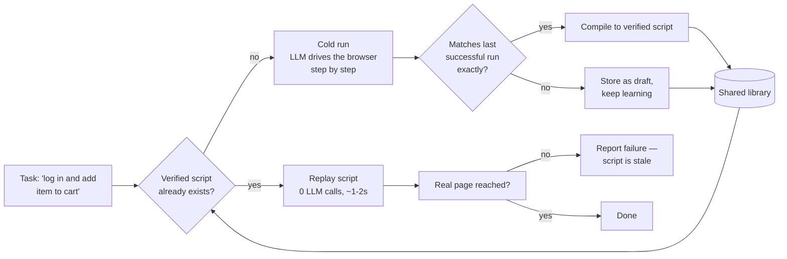
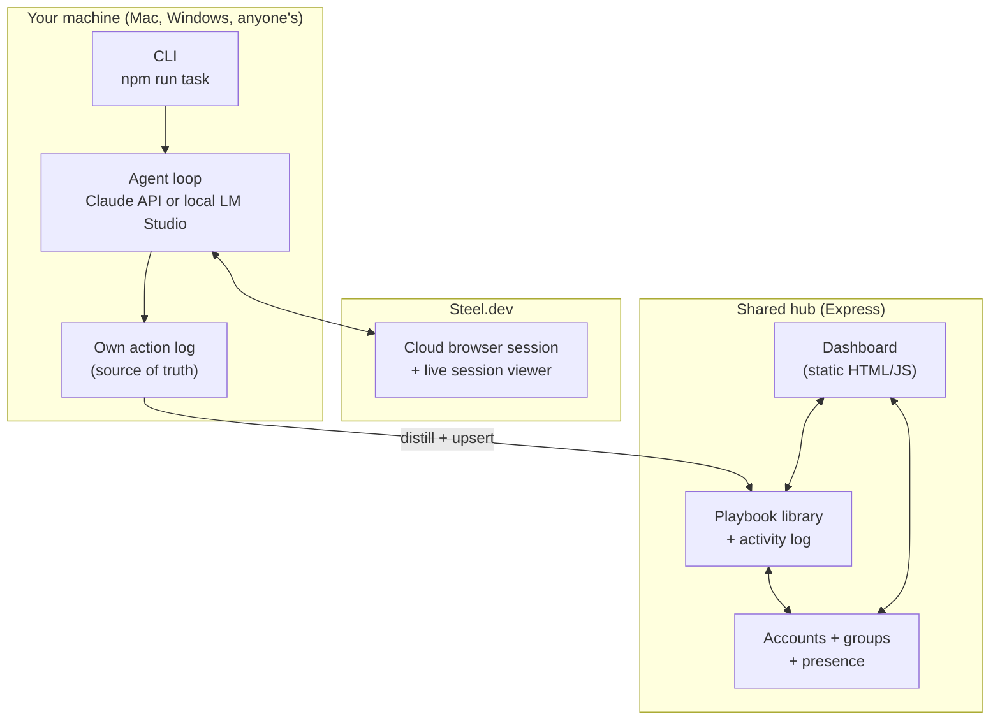

# hivemind

**Shared, self-compiling memory for browser-automation agents.**

Every AI agent that "browses the web" today starts from zero, every time — burning an LLM call to figure out where the login button is on the same internal tool your teammate's agent solved five minutes ago. hivemind fixes that: agents share one library, and once a task has been solved reliably twice, it compiles into a deterministic script the whole team replays instantly — no LLM, no re-reasoning, just execution.

Built on [Steel.dev](https://steel.dev) for cloud browser infrastructure.

---

## The idea

1. **An agent (Claude, or a local model via LM Studio) drives a real browser** through a task, described in plain English — "log in with X, add Y to the cart, check out."
2. **Every action it takes is logged** — not reconstructed after the fact from a trace API, but recorded live, by the code that actually clicked and typed, so it's never wrong about what happened.
3. **Once the same task succeeds twice with an identical action sequence, it graduates into a script** — a plain list of `{action, selector, value}` steps.
4. **From then on, that exact task replays the script directly** — zero LLM calls, sub-2-second execution, verified against the real page outcome (not just "didn't throw an exception").
5. **The whole thing is shared** — accounts, teams ("groups"), and a live dashboard mean one person's agent teaches the whole org's agents, not just their own.



## Why this is hard (and what we actually solved)

A few things looked simple and weren't — worth knowing because they're the actual engineering content here, not just glue code:

- **Steel's own session trace can't be the source of truth for compiled scripts.** It redacts every typed value down to a length (`{"inputType":"text","valueLength":8}`, never the literal text), uses undocumented event-type naming (`change` vs `input`), and on some client-side-routed sites emits extra phantom events that break any attempt to align values by position. hivemind's own agent loop already knows — with certainty — exactly what it clicked and typed and in what order, so that's the source of truth for compiled scripts. Steel's infrastructure (cloud browser, live session viewer) is still doing the actual work; its trace API just isn't used for compilation.
- **Playwright's coordinate-based `.click()` doesn't reliably work over Steel's `connectOverCDP()` connection** — it reports `viewportSize(): null` and can "succeed" while the synthetic click lands on the wrong pixel entirely, with no error. Every click in this codebase goes through a native `element.click()` invocation instead (`nativeClick()` in `src/agent/tools.ts`), which resolves the actual DOM node via Playwright's locator and clicks it directly — sidestepping coordinate math altogether.
- **A click that triggers navigation can tear down the JS realm mid-evaluation**, surfacing as `Execution context was destroyed` — which is actually proof the click worked, not a failure. Both the click path and the very next page-state read handle this explicitly rather than misreporting a working click as broken.
- **Replay isn't trustworthy just because nothing threw.** Submitting a form with a missing field fails silently on most sites — no exception, just a validation message. Replay checks the final URL against what the script expects before ever reporting success.

## Shared across a team

- **Accounts** — email + password, hashed with Node's built-in `scrypt` (salted, timing-safe comparison), never stored or logged in plain text.
- **Groups** — playbooks and activity are scoped per group, not global. Join an existing group or create one from a searchable list; switch anytime from the account menu. Two groups' data is fully isolated — verified by testing two independent accounts in separate groups.
- **Live dashboard** — the shared library (with expandable compiled scripts and editable human tips), a live activity feed across every teammate's runs, and a "run a task" form that works without touching a terminal.
- **Presence** — a green dot next to each teammate's name when they're active, and a spinning indicator when they currently have a task running — whether triggered from the dashboard or from someone's own terminal via the CLI.
- **CLI and dashboard share one identity model** — log into the dashboard, copy your API token from the account menu, drop it in `.env`, and the CLI authenticates as you, writing into the same group.

## Architecture



## Quickstart

### Prerequisites

- Node.js 18+
- A [Steel.dev](https://steel.dev) API key (free tier: 100 browser hours)
- Either an [Anthropic API key](https://console.anthropic.com) **or** [LM Studio](https://lmstudio.ai) running locally with a tool-calling-capable model loaded

### 1. Install
 
```bash
npm install
```

### 2. Configure 

```bash
cp .env.example .env
```

Fill in `STEEL_API_KEY` and either `ANTHROPIC_API_KEY` (with `LLM_PROVIDER=anthropic`) or `LOCAL_LLM_BASE_URL`/`LOCAL_LLM_MODEL` (with `LLM_PROVIDER=local`)

### 3. Smoke-test your setup

```bash
npm run smoke          # confirms Steel session creation works
npm run smoke:local    # (only if using a local model) confirms tool-calling works
```

### 4. Run solo (no accounts, no sharing)

```bash
npm run task -- "https://example.com" "click the Learn more link"
```

Run the identical command twice more — the third run should report `llmCalls: 0` and replay in under two seconds.

### 5. Run the shared hub (accounts, groups, dashboard)

```bash
npm run hub
```

Open `http://localhost:4001` — sign up, create or join a group, and use the dashboard's "Run a task" form, or point a teammate's `.env` (`HIVEMIND_HUB_URL` + `HIVEMIND_API_TOKEN`, copied from the dashboard's account menu) at your hub to share the library across machines.

## Try it yourself (for judges)

The clearest demo of the core mechanic, on a stable public test site:

```bash
npm run task -- "https://www.saucedemo.com/" "log in with username standard_user and password secret_sauce, then add the Sauce Labs Bolt T-Shirt to the cart"
```

Run it twice — the second run should report `"status":"verified"` in the library update log. Run it a third time and compare: `llmCalls: 0`, and total time drops from several seconds to roughly one. That's the whole pitch, end to end.

## Project structure

```
src/
  runTask.ts              orchestrator: check library → replay or cold-run → distill
  types.ts                shared types (User, Group, PlaybookEntry, TraceStep, ...)
  agent/
    loop.ts                Claude-driven agent loop
    loop.local.ts           LM Studio / OpenAI-compatible agent loop
    tools.ts                page-state extraction, action execution, native click fix
    replay.ts               zero-LLM script replay with outcome verification
  library/
    store.ts, runLog.ts     local JSON-file persistence (group-scoped)
    repo.ts                 client dispatcher: local file vs. shared hub over HTTP
    distill.ts               draft → verified compilation logic
    users.ts, groups.ts, sessions.ts, auth.ts, presence.ts
server/
  index.ts                 Express hub: auth, groups, presence, library API
  public/index.html         dashboard (vanilla HTML/CSS/JS, no build step)
```

## Tech stack

TypeScript · Node.js · Express · Playwright · [Steel.dev](https://steel.dev) SDK · Anthropic SDK · OpenAI-compatible client (for local models) · vanilla JS dashboard (no framework, no build step)

## Known limitations

- Native `<select>` dropdowns aren't supported yet — the agent's tool set is click/type/goto, and a real `<select>` opens a browser-native menu no tool can pick an option from.
- Distillation requires an *exact* repeated action sequence to graduate a script — genuinely ambiguous task phrasing (more than one valid way to accomplish it) will correctly never graduate, rather than freezing on one arbitrary path.
- Presence and session tokens are in-memory/file-based, not built for production scale — this is a hackathon project, not a hardened multi-tenant SaaS.
